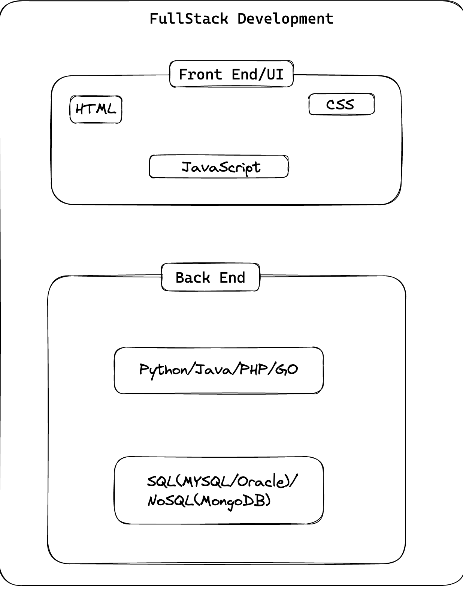

# FullStack web development(Python, Django, JavaScript, React and MySql)

## What is programing
  1. Provide (a computer or other machine) with set of instructions for the automatic performance of a task.
  
## What is fullstack
  ### FullStack Development
    Full stack development refers to the end-to-end application of software development, including the front end and back end programming. 
    The front end also refers UI Development consists of the user interface, and the back end takes care of the business logic, application workflows 
    and working with data sources.

  ### Reference as Image
  

    
  

#### UI (Client Side programming)                      
  2. HTML, CSS, and JavaScript ( Web/Mobile APP) 
  

#### Server (Back end programming)
  1. Python/Java/c#/Go/php 

#### Data Source 
  1. SQL (MySQL, Oracle, PostgresSQl)

## Python
  
  - What is python,
  
  - Why python 
  - What we can build with python
  - Installion, setup 

  **Fundamentals**
  
    - Variables and Data Types  
    - Working with strings and numbers 
    - Getting input from users 
    
  **Conditional statements**
  
  
  **Iteratives**
  
  
  

